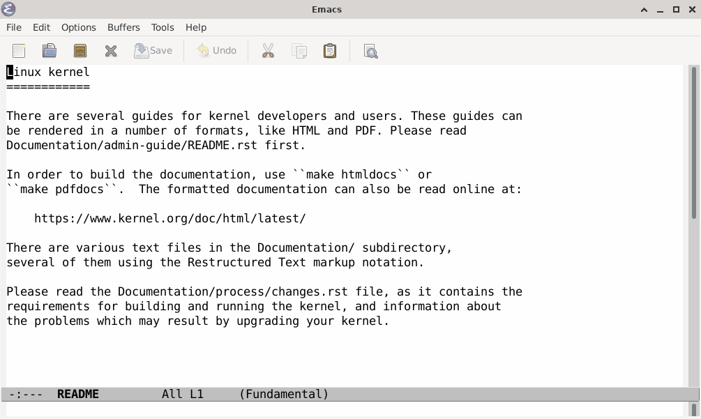

# fzf.el [](https://melpa.org/#/fzf)

An Emacs front-end for [fzf][1].



# installation

`fzf.el` is available on [MELPA][2].

Below is an illustrative `use-package` configuration of `fzf.el` showing all
available customizations and their default values.

> **Note**: This package does not set default keybindings.

```lisp
(use-package fzf
  :bind
    ;; Don't forget to set keybinds!
  :config
  (setq fzf/args "-x --color=bw --print-query --margin=1,0 --no-hscroll"
        fzf/executable "fzf"
        fzf/git-grep-args "-i --line-number %s"
        ;; command used for `fzf-grep-*` functions
        ;; example usage for ripgrep:
        ;; fzf/grep-command "rg --no-heading -nH"
        fzf/grep-command "grep -nrH"
        ;; If nil, the fzf buffer will appear at the top of the window
        fzf/position-bottom t
        fzf/window-height 15))
```

# usage

`fzf.el` comes with a number of useful commands:

### Using `FZF_DEFAULT_COMMAND`:
- `M-x fzf`
- `M-x fzf-directory`

### Searching for files:
- `M-x fzf-find-file`
- `M-x fzf-find-file-in-dir`
- `M-x fzf-recentf`

### Project-aware search:
- `M-x fzf-git`
- `M-x fzf-git-files`
- `M-x fzf-git-grep`
- `M-x fzf-hg`
- `M-x fzf-projectile`

### Grep:
> **Note**: `fzf-grep-*-with-narrowing` functions launch an interactive `fzf/grep-command` instead of using fuzzy filtering. [See the fzf advanced documentation for more details](https://github.com/junegunn/fzf/blob/master/ADVANCED.md).
- `M-x fzf-grep`
- `M-x fzf-grep-dwim`
- `M-x fzf-grep-in-dir`
- `M-x fzf-grep-with-narrowing`
- `M-x fzf-grep-dwim-with-narrowing`
- `M-x fzf-grep-in-dir-with-narrowing`

### Using input from Emacs:
- `M-x fzf-switch-buffer`

## define custom functions

`fzf.el` exposes functions to let you interface with `fzf` however you'd like:

- `fzf-with-command (command action &optional directory as-filter initq)`: Run `fzf` on the output of a shell command.
    - `command`: The shell command whose output is passed to `fzf`.
    - `action`: A function that handles the result of `fzf` (e.g. open a file, switch to a buffer, etc.). This package ships with two default actions that can handle opening a file and opening a file at a specific line.
    - `directory`: Directory to execute `fzf` in.
    - `as-filter`: If non-nil, use `command` as the filter instead of `fzf`'s fuzzy filtering. See `fzf-grep-*-with-narrowing` functions for example usages.
    - `initq`: If `as-filter` is non-nil, `initq` will be used as the value for the `--query` option. If `as-filter` is nil, this does nothing.
- `fzf-with-entries (entries action &optional directory)`: run fzf, passing in an elisp list and running the function action with the user's selected results.

Using these functions, it's easy to define your own commands that use fzf:

```lisp
(defun fzf-example ()
  (fzf-with-entries
   (list "a" "b" "c")
   'print))
```

Or more exciting:

```lisp
(defun fzf-find-file (&optional directory)
  (interactive)
  (let ((d (fzf/resolve-directory directory)))
    (fzf
    (lambda (x)
        (let ((f (expand-file-name x d)))
        (when (file-exists-p f)
            (find-file f))))
    d)))
```

## Interacting with the FZF buffer

When you run one of the above commands, you will see an "FZF" buffer. For example, when
using `M-x fzf`, you'll see a buffer that looks like:

```
 file1.ext
 file2.ext
 file3.ext
 ....
 > SELECTED-FILE            # RET (Enter) will open this file
 1580404/1580404            # Fuzzy find on my 1.6 million files
 > PATTERN                  # You type a fuzzy pattern to find
```
The *PATTERN* you type will narrow the selected items. PATTERN is used to do
[approximate string matching](https://en.wikipedia.org/wiki/Approximate_string_matching).
The PATTERN syntax is not a regular expression. In the examples below, we used
used `/regular expressions/` to illustrate the matching behavior. *The closest
match is listed first*.


| PATTERN&nbsp;&nbsp;&nbsp; | MATCH RESULT                                                                                                                                   |
|:--------------------------|:-----------------------------------------------------------------------------------------------------------------------------------------------|
| `foo`                     | Match file paths containing `/foo/`, `/f.*oo/`, `/f.*o.*o/`, etc.                                                                              |
| `foo bar`                 | Use spaces to specify multiple pattern terms, `foo bar` matches paths containing both terms, `/foo.*bar/`,  `/bar.*foo/`, `/f.*oo.*bar/`, etc. |
| `'foo`                    | File paths containing exactly the string foo (`/foo/`)                                                                                         |
| `!foo`                    | Negation, file paths that do not contain exact match, foo, in their name                                                                       |
| `^foo/bar`                | An anchored match, a term prefixed with ^ means match files starting with foo/bar                                                              |
| `.cpp$`                   | An anchored match, a term postfixed with $ means match files ending with .cpp                                                                  |
| `.c$ \| .h$`              | OR operator, match paths ending in .c or .h                                                                                                    |

For example, the pattern "`^apps/special 'foo !bar .c$ | .h$`" will match file paths starting with "apps/special"
that contain the string "foo", not the string "bar", and end in ".c" or ".h".

**Keys**

The FZF buffer, which you use to fuzzy find, is based on the underlying code for `M-x
ansi-term`. Most keys you type are sent to the fzf process. We've set the terminal escape key to
`C-x`. Use `C-x C-h` to see the Emacs command key bindings in the FZF buffer. For example, you can
maximize the FZF buffer window using `C-x 1` which closes the other windows in your Emacs frame, thus
giving you bigger FZF buffer window for fuzzy finding.

**Colors**

The FZF buffer picks colors based on the way Emacs was invoked (terminal, light background window
frame, or dark background window frame).  See the `fzf/args` defcustom to modify the colors or
use black and white.

**Colors in a terminal, emacs -nw**

When running in a terminal, emacs -nw, and you have an Emacs theme (see `M-x customize-themes`),
then the corresponding light or dark background color fzf setup will be used. Colors in Emacs work
best when running in a terminal with 24-bit truecolor support. For example, on recent Linux with
xterm-direct and Emacs 27 or later, this should give you truecolor in a terminal:

```bash
env TERM=xterm-direct emacs -nw
```

If you are running in a 256 color terminal, for example `env TERM=xterm-256color emacs -nw`, you may
wish to use a less dark yellow. This code is robust to either a 256 or truecolor terminal:

```lisp
;; Fixup term.el colors when running in an old 256-bit color terminal (emacs -mw).  For example, in
;; Emacs 27, term-color-yellow is "yellow3" which doesn't exist in 256-colors, so use "brightyellow"
;; which does exist. Following is a no-op when running in a truecolor terminal.
(eval-after-load 'term
  '(when (not (display-graphic-p)) ;; In terminal, emacs -nw?
     (let ((basic-color-alist
            ;; (NAME . NEW_COLOR) pair. If color string of face, term-color-NAME, does not exist and
            ;; and NEW_COLOR exists, update the face to use that.
            '(("yellow" . "brightyellow") ;; term-color-yellow == yellow3, map to brightyellow?
              ))
           (tty-colors (tty-color-alist)))
       (cl-loop for color-pair in basic-color-alist do
                (let* ((ansi-color (car color-pair))
                       (color-256 (cdr color-pair))
                       (color-face (intern (concat "term-color-" ansi-color)))
                       (term-color-string (face-attribute color-face :background)))
                  ;; If the term-color-string doesn't exist, we are likely running with 256 colors,
                  ;; in this case, use an color-256 if it exists.
                  (when (and (not (assoc term-color-string tty-colors))
                             (assoc color-256 tty-colors))
                    (set-face-attribute color-face nil
                                        :background color-256
                                        :foreground color-256)))))))
```

## Windows Support

On UNIX, fzf integration leverages the term.el package, which in turn leverages pty's and
Windows doesn't have a pseudo terminal concept. On Windows, processes communicate via pipes, so
the path that fzf.el took on UNIX will not work on Windows. Therefore, on Windows we open an
external cmd.exe to run fzf there and use temporary files to get the result back to Emacs.

# license

GPL3

[1]: https://github.com/junegunn/fzf
[2]: https://melpa.org
